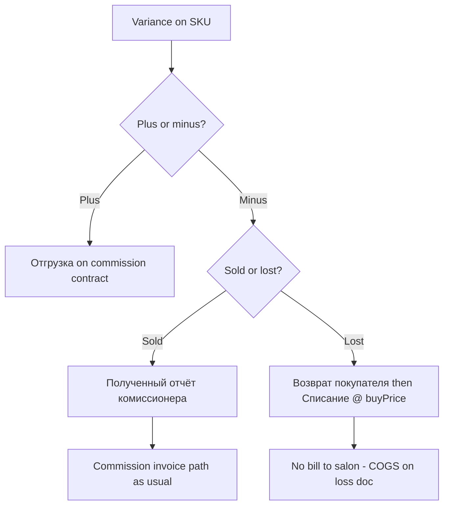

# Consignment Stock Reconciliation (MoySklad)

GENOSYS procedure for aligning **commission contract** stock at a salon/clinic with **physical count**, when the counterparty reports plus/minus variances.

**Worked example:** [SESSION_CHANGES_2026-05-29_SHAKIROVNA_LADIES_STOCK_RECON.md](./SESSION_CHANGES_2026-05-29_SHAKIROVNA_LADIES_STOCK_RECON.md) — Shakirovna Ladies Beauty Saloon, contract **00030**.

---

## When to use

- Salon/clinic on a **commission** (`Commission`) contract did a full or partial stocktake.
- They send lines like: *“collagen plus 2, sea algae minus 2”*.
- You need MoySklad **book balance at agent** to match **physical shelf**.

---

## Book balance formula

```text
Qty at agent = Σ Отгрузки (demand, this commission contract)
             − Σ Полученные отчёты комиссионера (commissionreportin, same contract)
             − Σ Возвраты покупателей (salesreturn, this counterparty)
```

Analysis script pattern: `scripts/moysklad-arfi-consignment-analysis.js` (read-only ledger).

Volna reference: [SESSION_CHANGES_2026-05-02_VOLNA_CONSIGNMENT_STOCK.md](./SESSION_CHANGES_2026-05-02_VOLNA_CONSIGNMENT_STOCK.md).

---

## Reading salon variances

| Salon says | Meaning | MoySklad books vs physical |
|------------|---------|----------------------------|
| **plus N** | N more on shelf than books | Books **low** → increase book (usually **отгрузка**) |
| **minus N** | N fewer on shelf than books | Books **high** → decrease book |

```text
Physical qty ≈ Book qty + (plus/minus from salon)
```

Always map salon product names to **MoySklad codes** before posting (confirm 50g cream vs radiance cream, PDRN pack vs ampoule, mask sheet vs pack).

---

## Decision tree: what to post



### Minus — sold (not yet reported)

- **Document:** `commissionreportin` on the commission contract.
- **Price:** MoySklad list / wholesale (VAT as per customer).
- **Effect:** Reduces consignment stock; salon owes per normal commission billing.
- **Script examples:** `moysklad-create-*-commission-report-*.js`

### Minus — lost / damaged / stolen

- **Do not** use warehouse-only **Списание** without reducing consignment first.
- **Step 1 —** `salesreturn` (Возврат покупателя): same qty, list prices, contract on doc if supported. Virtual return — goods not physically received.
- **Step 2 —** `loss` (Списание): same qty, **buyPrice** from product card, VAT off.
- **Effect:** Consignment balance down; warehouse briefly up on return then down on loss; **P&L = buy cost**.
- **Reference:** [gift write-off](./SESSION_CHANGES_2026-05-06_GIFT_INVENTORY_LOSS_MOYSKLAD.md), [Serene return](./SESSION_CHANGES_2026-04-30_SERENE_SKIN_RETURN.md).

### Plus — surplus on shelf

- **Document:** `demand` (Отгрузка) on commission contract, state **Отгружен**.
- **Effect:** Increases consignment stock to match physical.
- Optional: print **Consignment Stock Note** PDF (template: [SESSION_CHANGES_2026-05-11_GENOSYS_CONSIGNMENT_STOCK_NOTE_TEMPLATE.md](./SESSION_CHANGES_2026-05-11_GENOSYS_CONSIGNMENT_STOCK_NOTE_TEMPLATE.md)).

---

## Standard constants (GENOSYS UAE)

| Field | ID |
|--------|-----|
| Organization | `e18525a4-33c5-11ea-0a80-043f000b2738` |
| Store | `e186d449-33c5-11ea-0a80-043f000b273a` |
| Demand state Отгружен | `50d70717-4582-11ea-0a80-05e3001273a2` |
| Sales return state Возврат | `f793c585-01bb-11f1-0a80-1ac1000b5df5` |
| Commission report state (not paid) | `3203736c-c43b-11eb-0a80-093a002b59a6` |

**Dates:** always `scripts/lib/moysklad-uae-date.js` (`uaeMomentNow`, `uaeToday`) — never hardcode calendar dates in new scripts.

**Auth:** `MOYSKLAD_LOGIN` / `MOYSKLAD_PASSWORD` via `node --import dotenv/config`.

---

## Script template (Shakirovna Ladies 2026-05-29)

| Purpose | Script |
|---------|--------|
| Stock recon (lost + surplus) | `scripts/moysklad-create-shakirovna-ladies-salon-stock-recon-20260529.js` |
| Commission report | `scripts/moysklad-create-shakirovna-ladies-salon-commission-report-20260512.js` |
| Replenishment demand | `scripts/moysklad-create-shakirovna-ladies-salon-demand-20260512.js` |

```bash
node --import dotenv/config scripts/moysklad-create-shakirovna-ladies-salon-stock-recon-20260529.js
node --import dotenv/config scripts/moysklad-create-shakirovna-ladies-salon-stock-recon-20260529.js --commit
```

**Marker in `description`:** unique per event, e.g. `SHAKIROVNA-LADIES-STOCK-RECON-2026-05-29` — used for duplicate prevention.

---

## Pre-flight checklist

1. Confirm **exact counterparty name** in MoySklad (spelling “Saloon” vs “Salon”).
2. Confirm **commission contract number** (not retail / not another Shakirovna entity).
3. Map every variance line to a **product code**; resolve ambiguous names with salon.
4. Pull **book qty** per SKU; compute target physical.
5. Dry-run script; check warehouse availability for **отгрузка** lines.
6. Ask explicitly: minus = **sold** or **lost**?
7. `--commit`; re-run ledger on adjusted SKUs — all targets **OK**.

---

## Posting order (lost path)

1. `salesreturn` — moment T  
2. `loss` — moment T+2 minutes  
3. `demand` (if surplus) — moment T+5 minutes  

Staggering avoids MoySklad moment collisions and keeps audit trail readable.

---

## Related documentation

| Topic | File |
|-------|------|
| Shakirovna Ladies recon (full) | [SESSION_CHANGES_2026-05-29_SHAKIROVNA_LADIES_STOCK_RECON.md](./SESSION_CHANGES_2026-05-29_SHAKIROVNA_LADIES_STOCK_RECON.md) |
| Shakirovna May report/shipment | [SESSION_CHANGES_2026-05-12_SHAKIROVNA_LADIES_SALON_COMMISSION_REPORT.md](./SESSION_CHANGES_2026-05-12_SHAKIROVNA_LADIES_SALON_COMMISSION_REPORT.md) |
| Shakirovna Apr report/shipment | [SESSION_CHANGES_2026-04-29_SHAKIROVNA_COMMISSION_REPORT.md](./SESSION_CHANGES_2026-04-29_SHAKIROVNA_COMMISSION_REPORT.md) |
| Consignment templates | [SESSION_CHANGES_2026-05-11_GENOSYS_CONSIGNMENT_STOCK_NOTE_TEMPLATE.md](./SESSION_CHANGES_2026-05-11_GENOSYS_CONSIGNMENT_STOCK_NOTE_TEMPLATE.md) |
| ARFI consignment analysis | [SESSION_CHANGES_2026-04-27_ARFI_CONSIGNMENT_RECOMMENDATIONS.md](./SESSION_CHANGES_2026-04-27_ARFI_CONSIGNMENT_RECOMMENDATIONS.md) |
